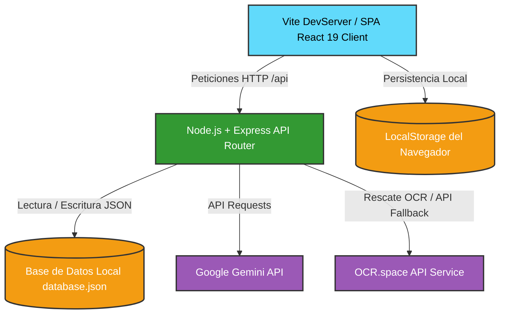

<div align="center">
  

  <h1>💼 ECU-CRM</h1>
  <p><strong>Sistema de Gestión de Clientes (CRM) Profesional para Consultorios y Freelancers</strong></p>
  
  <p>
    
    
    
    
    
  </p>
</div>

---

## 📌 1. Objetivos del Proyecto

El **ECU-CRM** es una plataforma web integral diseñada para resolver los desafíos de gestión de información y tiempos de respuesta que enfrentan los consultorios profesionales (médicos, jurídicos) y trabajadores autónomos (freelancers) en el contexto ecuatoriano. 

### El Problema que Resuelve
* **Dispersión y Pérdida de Datos**: Tradicionalmente, la información de clientes, historiales de consultas, cotizaciones e ingresos se maneja en formatos fragmentados. Este aplicativo centraliza la totalidad de los datos en un único panel accesible.
* **Falta de Seguimiento Histórico**: Permite registrar de manera secuencial la interacción con el cliente a través de una línea de tiempo dinámica de notas de seguimiento, llamadas telefónicas y bitácoras de auditoría, evitando la pérdida de contexto.
* **Tiempos de Respuesta Ineficientes**: Automatiza el registro de clientes y la facturación correspondiente a través de un escáner inteligente de comprobantes de transferencias bancarias de Ecuador (Banco Pichincha, Guayaquil, etc.), reduciendo el tiempo de digitación manual.

### Alcance de la Aplicación
1. **Módulo de Clientes**: Registro completo de información fiscal (RUC/Cédula, correo, teléfono, dirección, ciudad) con validación matemática en tiempo real.
2. **Ciclo de Estados del Servicio**: Flujo visual interactivo de los clientes a través de cuatro estados clave: *Contacto Inicial*, *En Desarrollo*, *Facturado/Cobrado* y *Finalizado*.
3. **Línea de Tiempo del Cliente (Timeline)**: Registro cronológico de notas de seguimiento, llamadas y bitácoras automáticas de cambios de estado.
4. **Gestión de Proyectos**: Creación y edición de proyectos asociados a clientes con fechas, presupuesto, responsable asignado y control de avance mediante checklists de tareas interactivas.
5. **Módulo de Facturación y Simulación del SRI**: Generación de facturas con desglose automático de base imponible e IVA del 15% (Ecuador), y simulación local del proceso de firma electrónica y obtención de clave de acceso de 49 dígitos del SRI (operación simulada localmente con fines educativos).
6. **Módulo Cotizador y Catálogo**: Creación rápida de presupuestos a partir de una lista de productos y servicios parametrizables.
7. **Control de Seguridad y Roles**: Gestión local de usuarios y roles con inicio de sesión y un PIN de seguridad ('1212') requerido en el backend para autorizar la eliminación de registros de clientes.

---

## 🏗️ 2. Arquitectura del Software

El sistema sigue una arquitectura de desarrollo moderna acoplada, estructurada en tres niveles clave: **Frontend declarativo (React SPA)**, **Capa de lógica y enrutamiento (Node.js Express Middleware)** y **Persistencia Híbrida (JSON de servidor + LocalStorage de cliente)**.



### Flujo de Funcionamiento Técnico

1. **Frontend (Capa de Presentación)**:
   * Desarrollado como una *Single Page Application (SPA)* reactiva bajo React 19 y TypeScript.
   * La interfaz está construida con componentes declarativos responsivos. La navegación y cambios de vista se manejan mediante estados en memoria (`activeTab`), lo que elimina las recargas de página y proporciona una experiencia fluida.
   * Las animaciones de interfaz y transiciones de estados se controlan a través de la librería **Motion**, dando micro-interacciones premium de alta fidelidad.

2. **Procesamiento de Lógica (Capa de Negocio y Servicios)**:
   * Un servidor backend ligero sobre **Express** atiende los endpoints bajo la ruta `/api`.
   * En entorno de desarrollo, el servidor Express se acopla directamente al ciclo de vida de **Vite** mediante un middleware de desarrollo en `vite.config.ts`, permitiendo depuración unificada bajo el puerto 3000.
   * En producción (`server.ts`), Express compila y sirve de forma estática los recursos de la carpeta `/dist` y ejecuta la lógica REST de `/api`.
   * **Validación Fiscal**: El frontend ejecuta el algoritmo matemático de validación para cédulas (Módulo 10) y RUCs ecuatorianos (Sociedades Privadas/Públicas y Personas Naturales vía Módulo 11) a través del archivo utilitario `ecuadorVal.ts` antes de enviar peticiones de persistencia.
   * **Pipeline de IA**: Para el escaneo de comprobantes bancarios, el backend implementa una tubería (*pipeline*) multi-modelo. Intenta consumir el modelo `gemini-3.5-flash` para extraer un JSON estructurado de la imagen. Si falla por cuota o latencia, escala a `gemini-2.5-flash-lite` y `gemini-3.1-flash-lite`. Si no se dispone de credenciales de IA, ejecuta un mecanismo de rescate (*fallback*) mediante llamadas HTTP a la API de **OCR.space**, procesando el texto obtenido con expresiones regulares avanzadas.

3. **Persistencia de Datos (Capa de Datos)**:
   * **Persistencia del Servidor**: Toda la información operacional (clientes, facturas, proyectos, catálogo de productos y registros de auditoría) se almacena en el archivo `database.json`. El servidor realiza lecturas síncronas (`fs.readFileSync`) y escrituras atómicas estructuradas (`fs.writeFileSync`) al recibir peticiones POST/PUT/DELETE.
   * **Persistencia del Cliente**: Las preferencias de configuración rápida —como el tema visual (Claro/Oscuro), el logotipo de la empresa cargado por el usuario en formato Base64, el estado del sonido del sistema y el token JWT simulado de sesión activa— se guardan directamente en el **LocalStorage** del navegador del usuario.

---

## 🛠️ 3. Stack Tecnológico

El proyecto está diseñado bajo estándares académicos rigurosos e implementa tecnologías de última generación:

* **HTML5 (Maquetación Semántica)**: Uso exhaustivo de etiquetas semánticas (`<header>`, `<nav>`, `<main>`, `<aside>`, `<section>`, `<footer>`) que optimizan la accesibilidad, legibilidad del código y la estructura para SEO.
* **TailwindCSS v4.0**: Framework de estilizado de última generación que prescinde de compilaciones externas lentas. Utiliza la directiva nativa `@import` e integra el procesamiento directo en Vite. Facilita la implementación de la paleta de colores corporativos y el soporte nativo para el modo oscuro (`dark:`).
* **JavaScript Moderno (ES6+) y TypeScript**: Lógica de cliente y servidor estructurada bajo tipado estricto con TypeScript (interfaces, tipos e imports ES Modules), lo cual elimina errores en tiempo de diseño y autocompleta el modelado de datos de forma segura.
* **Manipulación Eficiente del DOM (React 19)**: En lugar de manipular el DOM directamente con selectores tradicionales como `document.getElementById` (lo cual degrada el rendimiento de la aplicación en listas largas), React 19 utiliza el *Virtual DOM* para realizar cambios eficientes y controlados por estados de forma declarativa.
* **Express & Node.js**: Motor de servidor robusto y ligero para la distribución de APIs REST.
* **Motion**: Motor de animación física para micro-interacciones (hover, focus, activaciones de botones, entrada de modales).

---

## 📊 4. Modelo de Datos

De acuerdo con los requisitos académicos del proyecto y la rúbrica establecida, la persistencia base del CRM se define bajo una arquitectura de **Base de Datos No Relacional de almacenamiento Interno/Local vía LocalStorage** en combinación con almacenamiento plano en formato JSON interno (`database.json`) gestionado por el servidor local de Express.

A continuación se detalla la estructura del objeto JSON de clientes en cumplimiento estricto con los campos requeridos por la evaluación:

### Tabla de Estructura de Datos del Cliente

| Campo | Tipo de Dato | Ubicación / Persistencia | Descripción | Ejemplo de Valor |
| :--- | :--- | :--- | :--- | :--- |
| **id** | String (PK) | LocalStorage / database.json | Identificador único alfanumérico del cliente generado en base al nombre en formato Kebab-case. | `"roberto-martinez"` |
| **nombre** | String | LocalStorage / database.json | Nombre completo del cliente, representante o razón social de la empresa. | `"Roberto Martínez"` |
| **teléfono** | String | LocalStorage / database.json | Número de contacto celular o convencional (soporta formato internacional de Ecuador). | `"+593 4-259-8700"` |
| **estado** | String (Enum) | LocalStorage / database.json | Estado actual dentro del flujo del CRM: `contacto inicial`, `en desarrollo`, `cobrado` o `finalizado`. | `"en desarrollo"` |
| **notas** | String | LocalStorage / database.json | Bitácora de seguimiento, observaciones o detalles específicos de la última interacción. | `"Cliente corporativo clave. Interés alto en automatización."` |

---

### Estados del Cliente (`ClientStatus`)

El ciclo de estados comerciales del cliente en la aplicación se define en el archivo `types.ts` bajo la siguiente estructura tipada de TypeScript:
```typescript
export type ClientStatus = 'initial' | 'development' | 'billed' | 'finished';
```

En la interfaz de usuario, se realiza un mapeo dinámico a los nombres requeridos en español con estilos premium personalizados:

* **initial** (Mapeado a `contacto inicial`): Color naranja. Representa un prospecto recién registrado.
* **development** (Mapeado a `en desarrollo`): Color azul. Representa un proyecto o consultoría activa.
* **billed** (Mapeado a `cobrado`): Color verde. Representa un pago procesado y factura emitida.
* **finished** (Mapeado a `finalizado`): Color gris. Representa un servicio culminado con éxito.

---

### Estructura de Factura (`Invoice`)

Controla los documentos contables y los asocia a la facturación electrónica bajo regulación del SRI:

<table>
  <thead>
    <tr>
      <th>Campo</th>
      <th>Tipo de Dato</th>
      <th>Persistencia</th>
      <th>Descripción</th>
      <th>Ejemplo de Contenido</th>
    </tr>
  </thead>
  <tbody>
    <tr>
      <td><code>id</code></td>
      <td>String (PK)</td>
      <td>Servidor</td>
      <td>Identificador único alfanumérico autogenerado.</td>
      <td><code>"fac-1717462058000"</code></td>
    </tr>
    <tr>
      <td><code>invoiceNumber</code></td>
      <td>String</td>
      <td>Servidor</td>
      <td>Número secuencial oficial en formato ecuatoriano (Establecimiento-PuntoEmisión-Secuencial).</td>
      <td><code>"001-001-000008920"</code></td>
    </tr>
    <tr>
      <td><code>clientId</code></td>
      <td>String (FK)</td>
      <td>Servidor</td>
      <td>ID del cliente asociado en la base de datos.</td>
      <td><code>"banco-electrico"</code></td>
    </tr>
    <tr>
      <td><code>clientName</code></td>
      <td>String</td>
      <td>Servidor</td>
      <td>Nombre o Razón Social del cliente facturado.</td>
      <td><code>"Banco Eléctrico S.A."</code></td>
    </tr>
    <tr>
      <td><code>clientRuc</code></td>
      <td>String</td>
      <td>Servidor</td>
      <td>RUC o cédula del cliente receptor.</td>
      <td><code>"1790123456001"</code></td>
    </tr>
    <tr>
      <td><code>subtotal</code></td>
      <td>Number</td>
      <td>Servidor</td>
      <td>Base imponible sobre la cual se calcula el impuesto.</td>
      <td><code>4000.00</code></td>
    </tr>
    <tr>
      <td><code>taxRate</code></td>
      <td>Number</td>
      <td>Servidor</td>
      <td>Porcentaje de IVA vigente (15% en Ecuador = 0.15).</td>
      <td><code>0.15</code></td>
    </tr>
    <tr>
      <td><code>taxAmount</code></td>
      <td>Number</td>
      <td>Servidor</td>
      <td>Monto total recaudado por concepto de IVA (Subtotal * TaxRate).</td>
      <td><code>600.00</code></td>
    </tr>
    <tr>
      <td><code>total</code></td>
      <td>Number</td>
      <td>Servidor</td>
      <td>Valor total a pagar por la factura (Subtotal + TaxAmount).</td>
      <td><code>4600.00</code></td>
    </tr>
    <tr>
      <td><code>status</code></td>
      <td>String</td>
      <td>Servidor</td>
      <td>Estado de la factura: borrador, pendiente, autorizado o rechazado.</td>
      <td><code>"authorized"</code></td>
    </tr>
    <tr>
      <td><code>sriAccessKey</code></td>
      <td>String (Opcional)</td>
      <td>Servidor</td>
      <td>Clave de acceso de 49 dígitos requerida por el SRI para facturas electrónicas.</td>
      <td><code>"2005202601179012345600120010010000089201234567812"</code></td>
    </tr>
    <tr>
      <td><code>sriMessage</code></td>
      <td>String (Opcional)</td>
      <td>Servidor</td>
      <td>Mensaje de respuesta oficial devuelto por el servicio SRI.</td>
      <td><code>"AUTORIZADO - Comprobante firmado electrónicamente"</code></td>
    </tr>
  </tbody>
</table>

---

## 🤖 5. Metodología con Inteligencia Artificial

Durante el ciclo de desarrollo del proyecto, se empleó una metodología de asistencia con Inteligencia Artificial, integrando herramientas avanzadas como el asistente **Antigravity** (basado en arquitecturas de agentes autónomos) y modelos fundacionales de la familia **Gemini de Google**. Esta metodología aportó en las siguientes áreas críticas:

1. **Diseño de Algoritmos de Filtrado**: La lógica de filtrado de clientes en el panel principal se optimizó con la asistencia de la IA para manejar búsquedas cruzadas complejas en tiempo real (nombre, empresa, representante, tipo de servicio, estado comercial y filtros avanzados de facturación por RUC). Se recomendó la implementación del Hook `useMemo` de React para memorizar los resultados de búsqueda, evitando que re-renderizados innecesarios del formulario ralenticen la tabla principal del CRM.
2. **Pipelines de Integración de IA en Producción**: Se diseñó e implementó un pipeline en el servidor backend (`api.ts`) que interactúa de manera directa con la API de Gemini a través del SDK `@google/genai`. El modelo analiza imágenes de transferencias bancarias cargadas por el usuario, detecta patrones textuales de transacciones ecuatorianas (como nombres de bancos, RUC del ordenante y el monto exacto con centavos) y devuelve una estructura JSON limpia para automatizar la facturación.
3. **Depuración y Refactorización**: La IA asistió en la identificación de fallos lógicos durante el ciclo de vida de los estados (como la sincronización en tiempo real del logotipo de la empresa con el Favicon de la pestaña del navegador) y en la depuración de las funciones de validación matemática del algoritmo del dígito verificador para identificadores tributarios de Ecuador.

---

## 🚀 6. Instrucciones de Instalación y Despliegue

### Requisitos Previos
* **Node.js** (Versión 18.0 o superior recomendada).
* **NPM** (Gestor de paquetes de Node.js).
* Una clave de API de Google Gemini (opcional, para el escaneo inteligente de comprobantes).

### Ejecución en Entorno de Desarrollo (Local)

1. **Clonar o descomprimir** el proyecto en su máquina local.
2. Abrir una terminal en el directorio raíz del proyecto (`C:\Users\Elian\Downloads\ecu-crm\ecu-crm\ecu-crm`).
3. Instalar las dependencias de node:
   ```bash
   npm install
   ```
4. Crear un archivo `.env` en la raíz del proyecto (o duplicar `.env.example`) y configurar sus variables:
   ```env
   PORT=3000
   GEMINI_API_KEY="SU_CLAVE_API_DE_GEMINI"
   ```
   > [!TIP]
   > **Nota sobre la Evaluación del Escáner de Comprobantes (Modo Offline/Rescate)**:
   > Si el docente o evaluador no configura una clave de API de Gemini, el backend ejecutará automáticamente un pipeline de rescate (*fallback*):
   > 1. Intentará llamar a la API de **OCR.space** con clave pública.
   > 2. Si no hay conexión a internet o la API falla, se activa el **Simulador Inteligente (Mock Fallback)** del backend. Para probarlo de forma inmediata, simplemente suba cualquier archivo de imagen renombrado con la estructura: `comprobante_[banco]_[nombre_cliente]_[monto].png` (ejemplo: `comprobante_pichincha_roberto_martinez_4600.png`). El sistema extraerá e ingresará de forma realista el nombre, banco y monto, e intentará asociarlo con un cliente registrado.

5. Iniciar el servidor de desarrollo acoplado (Vite + Express API Middleware):
   ```bash
   npm run dev
   ```
6. Abra su navegador web e ingrese a la dirección: [http://localhost:3000](http://localhost:3000)

### Despliegue en Producción

Para construir el paquete optimizado para producción y correrlo sobre el servidor Express unificado:

1. Genere el build de optimización de React (compila los assets en la carpeta `/dist`):
   ```bash
   npm run build
   ```
2. Ejecute el servidor de producción:
   ```bash
   npm run start
   ```
3. El servidor arrancará en el puerto configurado (por defecto, el puerto 3000) y estará listo para producción.
